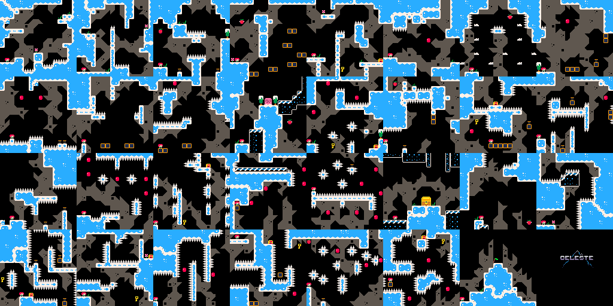
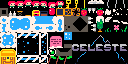
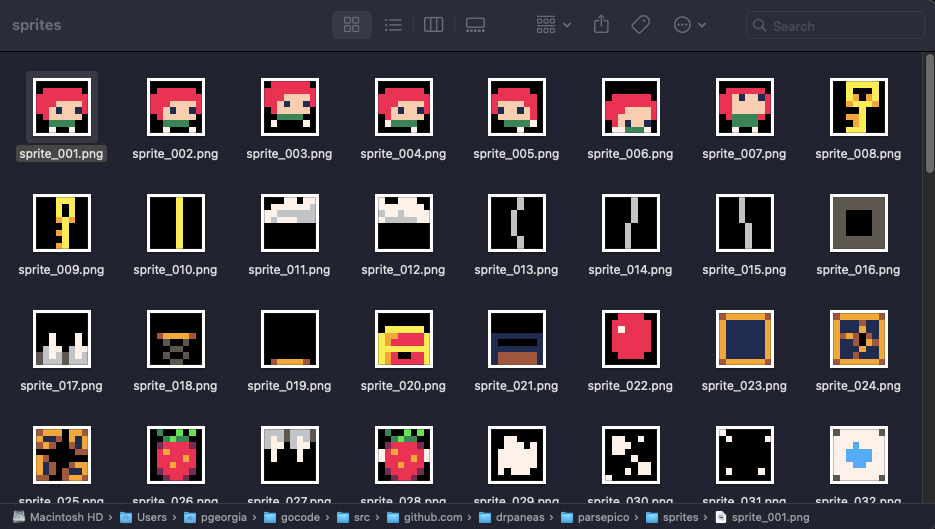

# Pico-8 Cartridge Parser

This project provides a command-line Go program that parses a Pico-8 cartridge (`.p8` file), extracts graphics (sprites) and map data, and saves them as PNG images. It also handles "dual-purpose" sections (`--3` and `--4`) commonly used as shared area between sprites and map data.

## Features

- **Extract Spritesheet**  
  Reads the `__gfx__` section of a Pico-8 cart and creates:
  - A `map.png` image that renders the map data (from the `__map__` section).
  - A `spritesheet.png` image that stacks sub-sections vertically (created from `section_0.png`, `section_1.png`, etc.).
  - Individual sprite files in `sprites/sprite_000.png` up to `sprites/sprite_XXX.png` (either 128 or 256 sprites).

- **Dual-Purpose Sections**  
  If you pass the flags `--3` or `--4`, the parser will also handle the higher sprite regions (sprite 128..191 and 192..255, respectively) which can store extra map or game data.

- **Configurable**  
  - Choose a custom `.p8` file path using `--cart`.
  - Remove old artifacts (the `sprites` folder, `map.png`, `spritesheet.png`) before generating new output with `--clean`.

## TODO

Soon enough ...

- [ ] Add support for parsing the code into AST.
- [ ] Add support for parsing the audio.

## Requirements

- Go 1.18+ (or any recent Go version)
- A Pico-8 `.p8` cartridge file

## Usage

1. **Build** the binary:

   ```bash
   go build -o parsepico8
   ```

   This produces an executable named `parsepico8`.

2. **Run** the parser:

   ```bash
   ./parsepico8 [flags]
   ```

   Common flags:
   - `--cart <file.p8>`: Specify the path to your Pico-8 cartridge.  
     *Default:* `/Users/pgeorgia/Library/Application Support/pico-8/carts/test.p8`
   - `--3`: Parse dual-purpose section 3 (sprites 128..191).
   - `--4`: Parse dual-purpose section 4 (sprites 192..255).
   - `--clean`: Remove the `sprites` directory, `map.png`, and `spritesheet.png` if they exist.

### Examples

- **Parse a normal `.p8` file** (no extra sections):

  ```bash
  ./parsepico8 --cart mygame.p8
  ```

  Generates:
  - `map.png`
  - `spritesheet.png` (with 4 sections stacked, each 128×32)
  - `sprites/` folder with 256 sprites and `section_0.png` .. `section_3.png`

- **Use dual-purpose section 3**:

  ```bash
  ./parsepico8 --cart mygame.p8 --3
  ```

  Generates:
  - `map.png` including extra data from sprites 128..191
  - `spritesheet.png` with only 2 sections total
  - `sprites/` folder with 128 sprites and `section_0.png`, `section_1.png`

- **Use dual-purpose section 4**:

  ```bash
  ./parsepico8 --cart mygame.p8 --4
  ```

  Similar behavior to `--3` but for sprites 192..255.

- **Use both `--3` and `--4`**:

  ```bash
  ./parsepico8 --cart mygame.p8 --3 --4
  ```

  Includes sprites 128..255 as dual-purpose data, exports only the first 128 sprite files and 2 section images.

- **Clean old outputs first**:

  ```bash
  ./parsepico8 --cart mygame.p8 --3 --clean
  ```

  Removes old `sprites/`, `map.png`, and `spritesheet.png` before extracting again.

## Output Files

- **`map.png`**  
  A rendered view of the tilemap section (`__map__`) plus any dual-purpose rows (if `--3` or `--4` are used).

- **`spritesheet.png`**  
  A vertical concatenation of each sub-image (`section_0.png`, `section_1.png`, up to `section_3.png`).  
  - If no flags are used, you'll have 4 sections, each 128×32 → final size 128×128.  
  - If `--3` or `--4` are used, only 2 sections are made (128×64 total).

- **`sprites/sprite_NNN.png`**  
  Individually exported 8×8 sprites, up to `sprite_255.png` if no dual-purpose flags are used, or up to `sprite_127.png` if `--3` or `--4` is specified.

- **`sprites/section_X.png`**  
  Each sub-image of the full 16×16 sprite sheet (128×32 segments). These are stacked into the final `spritesheet.png`.

- **`spritesheet.json`**
  A JSON file containing detailed information about each *available* sprite (based on `--3`/`--4` flags). Includes sprite ID, position on the sheet, pixel data (array of color indices), flags (bitfield and individual booleans), a `used` flag (true if not completely black), and the expected filename (`sprite_XXX.png`). It also contains metadata: sprite dimensions (8x8), grid dimensions (16x16), available sprite ranges, section usage flags (`--3`/`--4`), and the full PICO-8 palette.

  Example (`spritesheet.json` snippet):
  ```json
  {
    "version": "1.0",
    "description": "PICO-8 spritesheet export",
    "sprites": [
      {
        "id": 0,
        "x": 0,
        "y": 0,
        "width": 8,
        "height": 8,
        "pixels": [
          [ 0, 0, 0, 0, 0, 0, 0, 0 ],
          [ 0, 0, 0, 0, 0, 0, 0, 0 ],
          [ 0, 0, 7, 0, 0, 7, 0, 0 ],
          [ 0, 0, 0, 7, 7, 0, 0, 0 ],
          [ 0, 0, 0, 7, 7, 0, 0, 0 ],
          [ 0, 0, 7, 0, 0, 7, 0, 0 ],
          [ 0, 0, 0, 0, 0, 0, 0, 0 ],
          [ 0, 0, 0, 0, 0, 0, 0, 0 ]
        ],
        "flags": {
          "bitfield": 0,
          "individual": [ false, false, false, false, false, false, false, false ]
        },
        "used": true,
        "filename": "sprite_000.png"
      },
      // ... more sprites
    ],
    "metadata": {
      // ... metadata fields (palette, available ranges etc.)
    }
  }
  ```

- **`map.json`**
  A JSON file describing the map layout. Includes the map dimensions (width, height - depends on `--3`/`--4`), a name ("main"), and a list of map cells. Each cell has an `x`, `y` coordinate and the `sprite` ID placed at that location. The coordinates and sprite IDs cover the base map section and potentially the shared memory sections if `--3`/`--4` are used.

  Example (`map.json` snippet):
  ```json
  {
    "version": "1.0",
    "description": "PICO-8 map export",
    "width": 128,
    "height": 32, // or 48/64 depending on --3/--4 flags
    "name": "main",
    "cells": [
      {
        "x": 0,
        "y": 0,
        "sprite": 0
      },
      {
        "x": 1,
        "y": 0,
        "sprite": 0
      },
      // ... many more cells
    ]
  }
  ```

## Expected Output

```bash
./parsepico8 --cart $PICO8/carts/celeste.p8 --3 --4 --clean
```

Tilemap:


Spritesheet:



Individual sprites:



## License

This code is provided under the [MIT License](https://opensource.org/licenses/MIT). Feel free to use, modify, and distribute as needed.

Enjoy parsing your Pico-8 carts!
